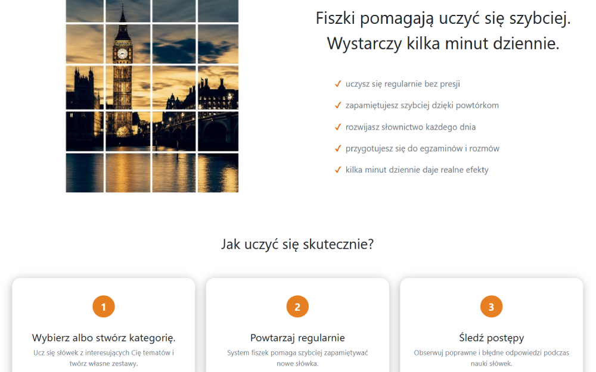
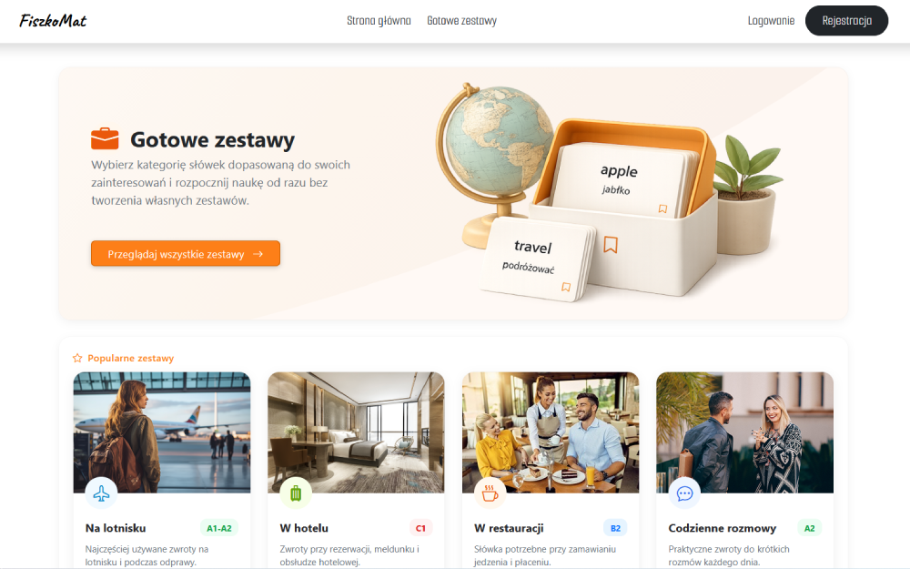
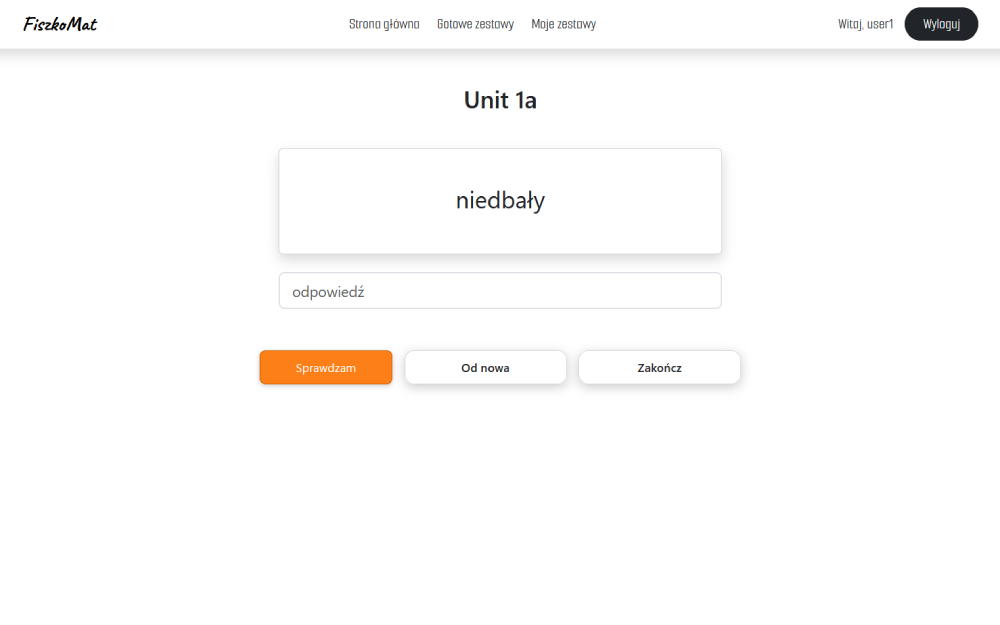
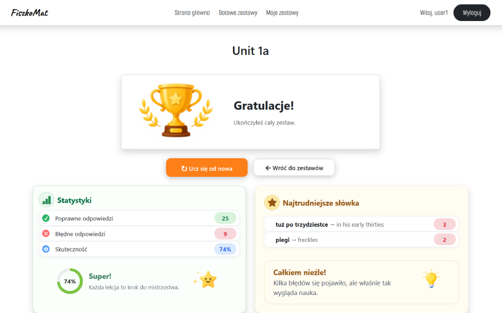

# FiszkoMat (MemoLoop)

A web application for learning English vocabulary through custom flashcard sets, ready-made public sets, and learning statistics.

## Live demo

[Open FiszkoMat](https://pgolebiewski07.alwaysdata.net/)

## Preview

### Home page

<p align="center">
  <kbd>
    
  </kbd>
</p>

### Ready-made sets

<p align="center">
  <kbd>
    
  </kbd>
</p>

### Study mode

<p align="center">
  <kbd>
    
  </kbd>
</p>

### Statistics

<p align="center">
  <kbd>
    
  </kbd>
</p>

## Features

- User registration, login and logout
- Create, edit, and delete private vocabulary sets
- Add Polish and English word pairs to a set
- Browse ready-made public sets with filtering, sorting, and pagination
- Mark sets as favourites and track featured sets
- Study cards and record learning sessions
- View learning statistics, including completed sessions and the current learning streak
- Access control: private sets are available only to their owner

## Tech stack

- Python 3.13
- Django 6
- PostgreSQL in production
- SQLite for local development
- pytest + pytest-django
- WhiteNoise for static files in production
- HTML and CSS

## Local setup

```bash
git clone https://github.com/piotrgolebiewski07/memo_loop.git
cd memo_loop
python -m venv .venv
```

## Activate the virtual environment

```powershell
# Windows PowerShell
.venv\Scripts\Activate.ps1
```

```bash
# macOS / Linux
source .venv/bin/activate
```

## Install dependencies and start the application

```bash
pip install -r requirements.txt
python manage.py migrate
python manage.py runserver
```

The app will be available at http://127.0.0.1:8000/.

## Environment variables

Create a local `.env` file based on `.env.example`:

```env
SECRET_KEY=your-secret-key
DEBUG=True
ALLOWED_HOSTS=localhost,127.0.0.1
```

For PostgreSQL, also set `DB_NAME`, `DB_USER`, `DB_PASSWORD`, `DB_HOST`, and `DB_PORT`.

## Tests

Run the test suite with:

```bash
pytest
```

The project includes tests for models, views, business logic, statistics, permissions, and public/private sets.

## Deployment

The application is deployed on AlwaysData using Python WSGI, PostgreSQL, and WhiteNoise. Sensitive configuration is stored in environment variables and is not committed to the repository.
